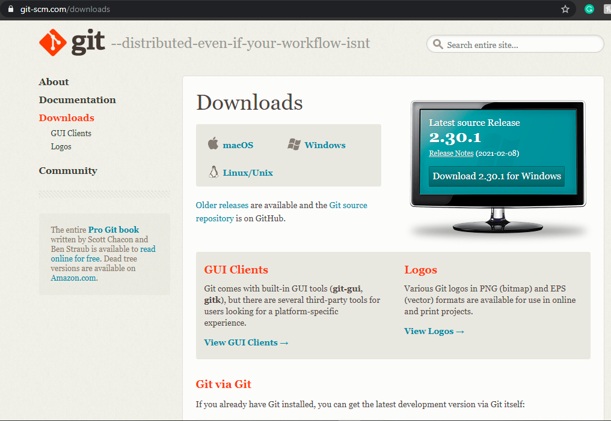

# A03

<h1> Introduction to GitHub </h1>
<strong>GitHub</strong> is a free open-source version control 
system. It is used to track changes in an individual or 
group project's source code and can have one or more 
"contributors."

GitHub can be accessed through a command line called <strong>GIT</strong>, or through 
applications like <strong>WebStorm</strong>, and a browser using GitHub.

Installing GIT, WebStorm and making a GitHub account:
<ul>
    <li>Download GIT <a href = "https://git-scm.com/downloads"> here</a>.
        The url is https://git-scm.com/downloads</li>
        
    <li>Download WebStorm <a href="https://www.jetbrains.com/student/">here</a> under "Developer Tools".
        The url is https://www.jetbrains.com/student/</li>
        
    <li>Install both in your local computer.</li>
    <li>Head over to <a href="https://github.com/join">GitHub</a> website. Create a new account and set up a new 
        <strong>repository.</strong></li>
         
</ul>