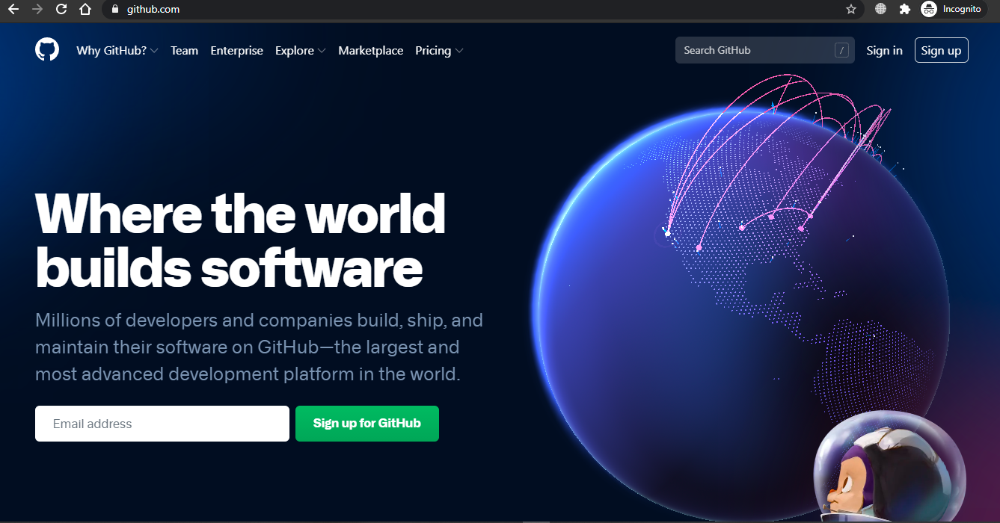

# A03

<h1> Introduction to GitHub </h1>
<strong>GitHub</strong> is a free open-source version control 
system. It is used to track changes in an individual or 
group project's source code <strong>remotely</strong> and can have one or more 
"contributors."

GitHub can be accessed through a command line called <strong>GIT</strong>, or through 
applications like <strong>WebStorm</strong>, and a browser using GitHub.

Installing GIT, WebStorm and making a GitHub account:
<ul>
    <li>Download GIT <a href = "https://git-scm.com/downloads"> here</a>.
        The url is https://git-scm.com/downloads</li>
        
    <li>Download WebStorm <a href="https://www.jetbrains.com/student/">here</a> under "Developer Tools".
        The url is https://www.jetbrains.com/student/</li>
        
    <li>Install both in your local computer.</li>
    <li>Head over to <a href="https://github.com/join">GitHub</a> website. Create a new account and set up a new 
        <strong>repository.</strong></li>
         
    <li>Connect your GitHub repository to Webstorm. When you first start WebStorm, click the branch icon and select a folder
        in your current device to <strong>clone</strong> your repository. Enter your repository details. 
        Now you can <strong>add, commit and push</strong> into GitHub directly from WebStorm.</li>
    <li>Edit your Readme.md file so that it displays the details of your project.</li>
    <li>After you are done editing your Readme.md file, click on Git on the taskbar and choose commit.
         This will prompt you to type a message as it readies your changes to be written into GitHub.</li>
    <li>When you are done typing your commit message, click push. this will prompt you to select the branch
        to which you want to commit.
         Note: You will need to use different branches in the future to test your code online 
            without making changes to your original project. 
            You will need to <strong>merge</strong> the branch into your master branch to add it to the project.
            Choose master for now.</li>
    <li>Upon checking your GitHub, you will see that your changes have been saved.</li>
</ul>

<h2>Glossary</h2>
<ul>
    <li>Branch: The official working version of your project. It is merged into the master branch for the final release.</li>
    <li>Clone: The copy of your GitHub repository that you create on your local computer.</li>
    <li>Commit: The initial phase of deploying your code that tells you if there is any conflicts.</li>
    <li>Fetch: An initial version of pull, in which you can review all the commits and changes before incorporating them into your local repository.</li>
    <li>GIT: The most commonly used version control system used by GitHub.</li>
    <li>GitHub: A code hosting platform that uses GIT to allow multiple users(contributors) to work on a project.</li>
    <li>Merge: The act of putting two or more branches of code together after they are ready to be deployed.</li>
    <li>Merge Conflict: While merging, if the branches and the code in them cannot have a smooth transition due to overwriting or two versions of the same file, a merge conflict arises.</li>
    <li>Push: After commit, you push your code into GitHub i.e., upload to GitHub.</li>
    <li>Pull: The opposite of push, where you download the code from GitHub into your local machine.</li>
    <li>Remote: A situation in which users can work in a project on;ine from their own machines.</li>
    <li>Repository: Another name for a GIT folder, where all the code is saved.</li>
</ul>
